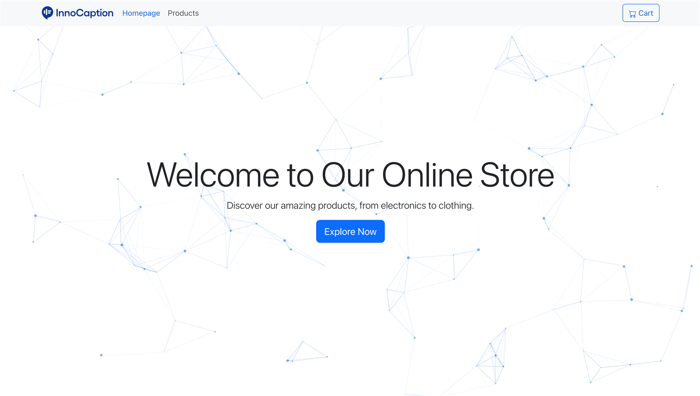

# Running the Project

To run this project, ensure you have Node.js installed on your system. Then, follow the steps below:

1. Download the code from github repository
2. Open a terminal in the project directory.
3. Run the command `npm i && npm start`

After completing these steps, the project should be running on `localhost:3000`.
Open your browser and navigate to `http://localhost:3000` to view the project.

## Homepage Preview

## Product Page Preview

## Cart Page Preview

